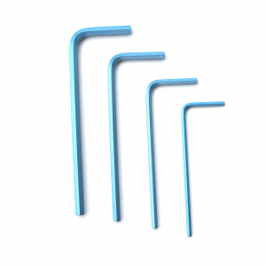

## Introduction

The Water Linked [DVL-A50](https://waterlinked.com/product/dvl-a50/) is designed to integrate with most ROVs and AUVs through ethernet and/or a serial interface (UART). To minimize the time between a customer gets the DVL-A50 and to having it up and running on their hardware platform, the DVL-A50 is shipped with an attached IO interface providing ease of connectivity with power, ethernet and serial.. However, for most ROVs and AUVs the DVL-A50 has to be integrated with the on-board electronics through a penetrator or a subsea connector.

This guide details how the DVL-A50 can be integrated with the BlueROV2.

## Parts and tools

What parts and tools are needed depends on whether you intend to permanently attach the DVL-A50 to the BlueROV2, have it semi-permanently attached, or use a subsea connector for quick installation/removal.

| Installation type | Option |
| ----------------- | :------ |
| Permanent with penetrator and IO Interface | 1 |
| Semi-permanent with penetrator and connectors | 2 |
| Subsea connector | 3 |

### You will need

The following are needed for all installation options:

* [BlueROV2](https://bluerobotics.com/store/rov/bluerov2/bluerov2/)

* [Hex Key Set](https://bluerobotics.com/store/watertight-enclosures/enclosure-tools-supplies/tool-hex-set-r1/)

* [Penetrator Wrench](https://bluerobotics.com/store/cables-connectors/tools/tool-penetrator-wrench-r1/)

* [BlueROV2 mounting bracket](https://waterlinked.com/store/). This is optional, but protects the DVL-A50 and allows for 0 cm minimum altitude.

You will also need

* 5 mm universal drill bit
* 2 x M5x12 mm stainless steel pan head screws (included with BlueROV2 mounting bracket)
* 4 x M3x4 mm stainless steel countersunk flat head screws (included with BlueROV2 mounting bracket)
* De-/soldering iron
* Utility knife 
* Wire stripping tool

## Preparation

### Seperate IO Interface from DVL-A50

The first thing you will have to do before going about any of the installation options is to cut the DVL-A50 cable, separating the IO Interface board. We recommend you do so near the end where the IO Interface board is to begin with. 

!!! Warning
	The DVL-A50 cable is permanently attached and non-replacable inside the DVL-A50. If you cut the cable too short you will either have to splice the cable with another cable, or order a new DVL-A50. Measure twice, cut once!

### Attaching the BlueROV2 mounting bracket

* Attach the BlueROV2 mounting bracket to the DVL-A50 using 4 x M3x6 screws.

The BlueROV2 mounting bracket can be attached to the BlueROV2 in one of the 2 places indicated in the image below (standard BlueROV2).

!!! Note
	In this configuration the DVL-A50 is pointing backwards meaning both the x-direction and the y-direction are flipped. Multiplying the velocity data in x- and y-direction with -1 will flip coordinates back again to the same perspective frame of the BlueROV2.

If your BlueROV2 has the Heavy Configuration upgrade, the BlueROV2 mounting bracket can be attached such that the DVL-A50 is within the BlueROV2 frame.

* Mark 2 hole positions on the BlueROV2 frame for attaching the BlueROV2 mounting bracket and drill through the frame using a 5 mm universal drill bit.

Check that the BlueROV2 mounting bracket will attach properly to the BlueROV2 frame using 2 x M5x12 mm screws, but do not secure the bracket in place as more work is needed on the cable end.

### Final cable lenght

With the DVL-A50 now attached to the BlueROV2 frame, find the appropriate cable length needed by leading the cable back to the penetrator end cap of the BlueROV2 and add length of the electronics enclosure (30 cm). This is the *minimum* required cable length.

!!! Note
	We recommend adding atleast another 30 cm to the cable to provide enough service loop in case the penetrator fails or the leads get damaged.

Cut the cable to the final length.

## Option 1. Permanent installation with penetrator and IO Interface

The DVL-A50 is permanently installed on the BlueROV2 with the IO Interface board which is supplied with the DVL-A50.

For this installation you will additionally need:

* [M10 Cable Penetrator for 6mm Cable](https://bluerobotics.com/store/cables-connectors/penetrators/penetrator-10-25-a/) from Blue Robotics
* Potting compound (possible options in appendix A)
* [Potting kit](https://bluerobotics.com/store/cables-connectors/tools/tool-potting-kit-r1/) from Blue Robotics
* Solder wire
* Tweezer or nose pliers
* Solder wick and/or desoldering pump

### IO Interface preparation

* Cut off the zip tie holding the cable onto the IO Interface board

* Cut off the individual wires soldered onto the IO Interface board. Leave enough wire to grab onto with a tweezer or nose pliers.

* Desolder all the cut wires. Use solder wick and/or a desoldering pump to remove any excess solder from the now desoldered through hole pads.

!!! Warning
	Using too much force or heat may delaminate the IO Interface PCB, rendering the IO Interface board useless.

### Adding a penetrator

!!! Note
	The penetrator will be pottet using a potting compound. Most potting compounds need several hours or days to harden, so prepare a space where the potting can be left undisturbed for longer periods. Note also that working with potting compounds may get messy, so place old newspapers or some cardboard over the work area, and have single use tissue nearby to clean any mess.

* Strip off 25-30 cm of the cable jacket using a utility knife or a sharp blade. Take care not to cut into the leads inside the cable.

* Feed the now exposed leads through the penetrator starting from the head, and continue feeding until the cable jacket is situated within the shoulder of the penetrator.

* With the threads of the penetrator pointing downwards and the cable pointing upwards, pour potting compound into the space between the cable and the penetrator. Fill with potting compound until it is flush with the top of the penetrator. It is a good idea to hold the penetrator in place using a clamping vice.

* Let the potting compound harden before proceding.

* Turn the penetrator upside downs and fill the gap between the leads with more potting compound.

* Let the potting compound fully cure before proceding.

