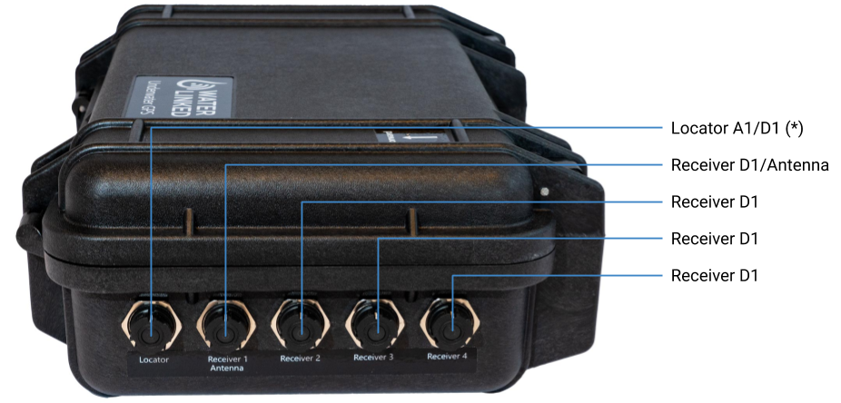

# Hardware Setup

## Connectors

### Receiver-D1 setup

* Connect the four Receiver-D1 cables to bulkheads marked "Receiver 1" to "Receiver 4" on the housing.

* If using the Locator-D1, connect this to the bulkhead marked "Locator" on the housing.

* If using the Locator-A1, connect this to the bulkhead marked "Locator" on the housing.

* If using the Locator-U1, no connections to the housing is needed. Just power the Locator and make sure both status leds on U1 and Master-D1 are solid green.

## IMU

The master electronics has an built in IMU used to provide the orientation of the master electronics. This is used in combination with the acoustic position and GPS to generate the global position of the Locator.

### IMU Calibration

For the IMU to work properly it needs to be calibrated. The calibration data is stored when full calibration is obtained for faster calibration on restart of the system. If the system is started on a new location a new calibration is needed for the IMU to work as intended.

To calibrate the IMU disconnect all Recivers and Locator cables, but leave power and Ethernet connected. This is to prevent damaging the cables and connector when performing the calibration. While looking at the top bar in the web GUI on the IMU status, move the peli case in a figure of 8 until all the bars are green.
