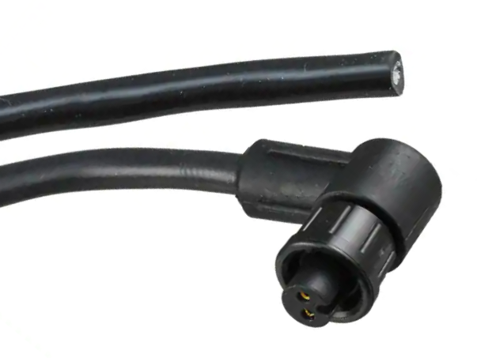

# Power supply

The Underwater GPS G2 can be powered using either the provided power cable connected to a 12VDC source, or with a battery (not provided).

## Power cable

| Connector position | Manufacturer | Part number |
| ------------------ | :----------- | :---------- |
| Underwater GPS Housing | Switchcraft | 17282-2PG-300 |
| Power cable | Switchcraft | CARA162802S19790 |

The power cable comes with a blunt cut end. Strip the jacket and connect the wires to your favorite 12V power source.

|              |                     |
| ------------ | :------------------ |
| Black      : | Negative            |
| White      : | Positive            |
| Voltage    : | 10V – 30V           |
| Current    : | 0.7A  (12V nominal) |
| Protection : | Reverse polarity    |

Both the power button and the power input can be found on the right side of the Underwater GPS housing.
The power button will illuminate when the power is switched on.

!!! Note
	There is both an external latching power button and an internal power switch. These are OR configured, meaning they override each other. By default, the internal power switch is in the OFF position.

## Battery

A battery may be used instead of wired power. Use a battery with a nominal voltage within the voltage range. A Molex-to-XT60 cable assembly is provided with the Underwater GPS kit for ease of connection to battery packs with XT60 connectors.
The battery pack can be secured within the Underwater GPS housing using the provided non-slip battery strap.

Maximum battery width: 50 mm. 